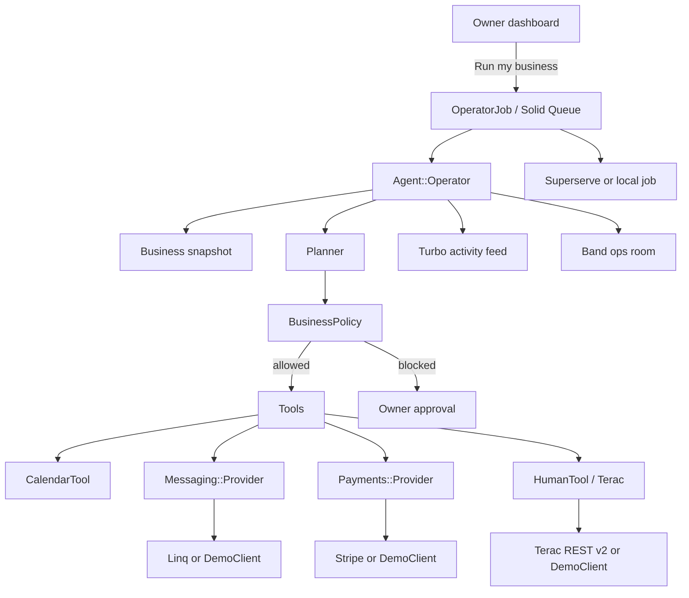

# Operator

**You run the service. Your operator runs the business.**

Operator is an autonomous business operator for solo appointment-based professionals in Europe. The first persona is a personal trainer in Warsaw. The same system fits speech therapists, physiotherapists, tutors, beauty professionals, and coaches.

This is not a chatbot and not a generic AI assistant. It is a tool-using agent with a policy ceiling. It books the empty slot, chases the unpaid invoice, follows up the quiet client, and hires a real human when it is not confident enough to answer.

> I gave an AI the rules for my business. Now it runs the boring parts.

**[Live demo path]** clone → `bin/setup` → `bin/dev` → **Run a demo** → **Run my business**. Zero API keys required.

---

## 1. Problem

A solo trainer who is excellent on the floor still loses evenings to:

- appointment requests and cancellations
- no-shows and empty calendar slots
- unpaid invoices
- lead follow-ups
- inactive clients who used to book every week
- review asks
- small operational decisions

Miss one of those and the week leaks revenue. Do all of them by hand and the craft suffers.

## 2. Product

Operator watches one local business and, on a single **Run my business** click, works the morning list:

1. Reads calendar, invoices, leads, and recent messages
2. Chooses the next useful action
3. Checks it against the owner’s `BusinessPolicy`
4. Executes through tools (calendar, messaging, payments, Terac)
5. Writes what it did in plain language on a live activity tape
6. Repeats until nothing useful remains

The owner should not be handling that list manually.

Seeded demo business: **Anna Fitness**, Warsaw, PLN, `Europe/Warsaw`.

## 3. Why a solo business needs it

The work around the service is repetitive, policy-shaped, and expensive when missed. Operator stays inside the rules the owner wrote (`max_auto_refund`, `max_agent_spend`, `max_human_task_cost`). When a question is medical, local, or uncertain, it stops guessing and hires a verified human through Terac.

## 4. Architecture

Rails 8 monolith. PostgreSQL. Solid Queue. ERB + Turbo + Stimulus + Tailwind. No SPA, no Redis, no microservices.



Loop: observe → reason → select action → policy check → execute tool → persist → observe again. Long work runs in a background job and is resumable.

## 5. Sponsor integrations

Used where they change the product, not as logos. Every adapter has a demo fallback so the app runs with zero credentials.

| Sponsor | Role in the product | Demo fallback |
| --- | --- | --- |
| **Terac** | Human escalation: quote before spend, launch, poll, provenance | `Humans::DemoClient` |
| **Linq** | Customer messaging (iMessage / RCS / SMS) + inbound webhooks | `Messaging::DemoClient` + simulated replies |
| **Stripe** | Session checkout and late-payment links; webhooks are source of truth | `Payments::DemoClient` |
| **Band** | Operations-room events for the agent | local log |
| **Superserve** | Isolated sandbox for the daily run | in-process Rails job |
| **Replay** | QA boundary (`Qa::ReplayClient`) | Rails system test |
| **Whop** | Optional digital programs / memberships | demo catalog |

Terac talks to the current REST API (`https://terac.com/api/external/v2`) and MCP catalog:

`terac_request_feasibility` → `POST /quotes` → poll until `RESPONDED`/`PRICED` → `POST /opportunities` → `POST /opportunities/:id/launch` → submissions.

Pricing is never invented. Demo mode returns a deterministic $18 quote, under Anna’s €20 human-task cap.

## 6. Running locally

Requires **Ruby 3.3+** and **PostgreSQL**.

```bash
git clone https://github.com/kewinzaq1/operator.git
cd operator
bin/setup
bin/dev
```

Open [http://localhost:3000](http://localhost:3000) → **Run a demo**.

If port 3000 is taken:

```bash
PORT=3040 bin/dev
```

`bin/setup` installs gems, prepares the database, and seeds Anna Fitness.

## 7. Demo mode

`DEMO_MODE=true` is the default. Providers are simulated. **Every booking, payment, message, and escalation still persists** exactly as it would with live APIs.

The UI shows a small **Demo** pill — nothing else about demo mode is advertised.

`DEMO_MODE=false` plus real keys swaps adapters. Missing keys also keep the demo adapters.

## 8. Environment variables

Copy `.env.example`. Never commit secrets.

```text
DEMO_MODE=true
OPERATOR_PACE=0.7
APP_HOST=localhost:3000

STRIPE_SECRET_KEY=
STRIPE_WEBHOOK_SECRET=

LINQ_API_TOKEN=
LINQ_PHONE_NUMBER=

TERAC_API_KEY=

BAND_API_KEY=
BAND_CHAT_ID=

SUPERSERVE_API_KEY=
SUPERSERVE_BASE_URL=https://api.superserve.ai

WHOP_API_KEY=
WHOP_COMPANY_ID=

REPLAY_QA_API_KEY=
```

Webhooks (when live providers are connected):

- `POST /webhooks/stripe`
- `POST /webhooks/linq`
- `POST /webhooks/whop`

Health: `GET /up` and `GET /health`.

## 9. Production deployment

Render Blueprint: [`render.yaml`](render.yaml).

- Rails 8 web service + Thruster
- Render Postgres
- Solid Queue inside Puma (`SOLID_QUEUE_IN_PUMA=true`)
- Health check `/up`
- `bin/render-build.sh` migrates and seeds the demo studio

In Render, set `RAILS_MASTER_KEY` from your local `config/master.key` and `APP_HOST` to the Render hostname. Optional worker: `bundle exec rake solid_queue:start` if you turn the Puma plugin off.

## 10. Demo script

This is the three-minute judge path.

1. Open the app. Landing: *You run the service. Your operator runs the business.*
2. **Run a demo** — Anna Fitness, today, Filip cancelled 17:00.
3. Click **Run my business**.
4. Watch the receipt tape:
   - business check
   - 17:00 cancellation → Marta contacted → she accepts → slot booked → Stripe payment link
   - Piotr’s overdue 70 zł reminder
   - Kasia’s rebooking (usual interval 7 days, last session 13 days ago)
   - unanswered lead
   - review requests
   - Wojtek’s injury question
5. Confidence 62%. Operator calls **Terac**, quotes **$18** (under the cap), takes the physiotherapist result, texts Wojtek.
6. Impact: recovered session, recovered invoice, messages sent, minutes of admin avoided. *You have nothing urgent to do.*

**Reset demo** puts the studio back to this morning so you can run it again.

```bash
bin/rails test
bin/rails test:system
```
